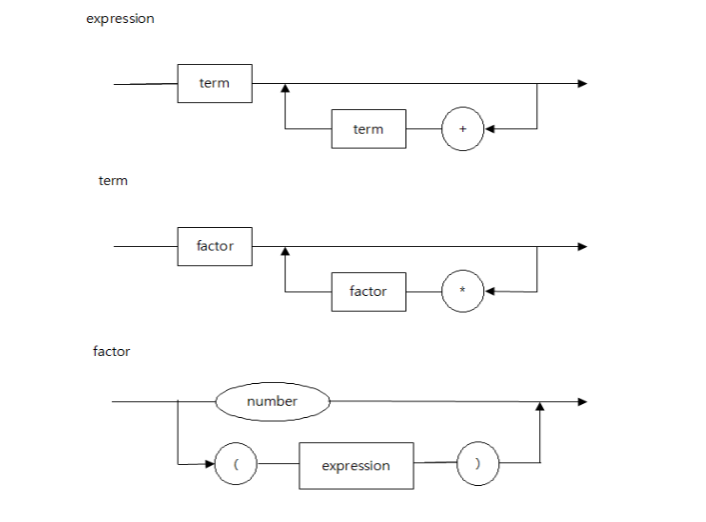
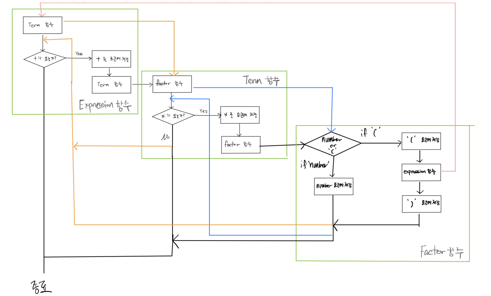

# Assignment 1 | Recursive Descent Parser
## Create Parser

- As shown in the image above, create a parser that follows 3 rules. This parser can check if an expression is correctly structured (i.e., if it can be compiled) and can also perform simple arithmetic operations. The flowchart for this parser's algorithm is as follows.
